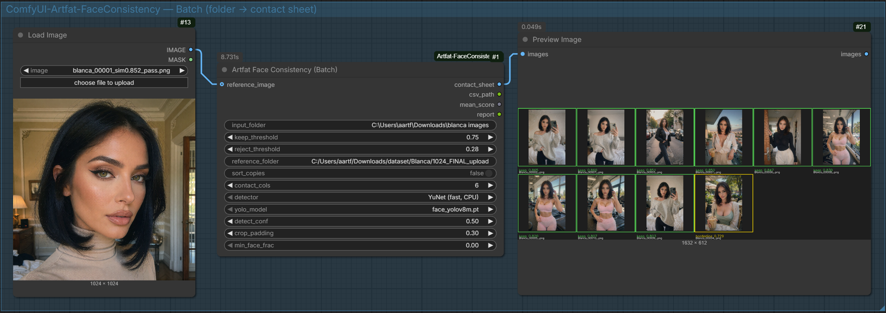
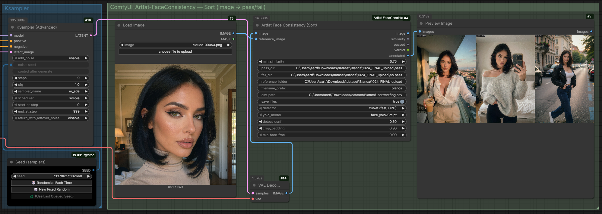
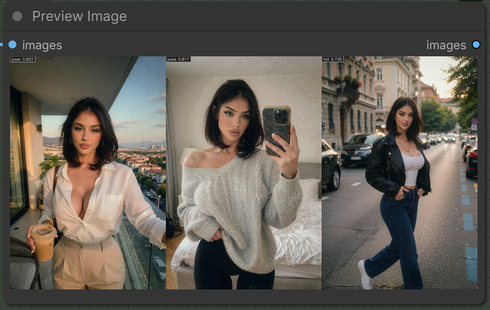
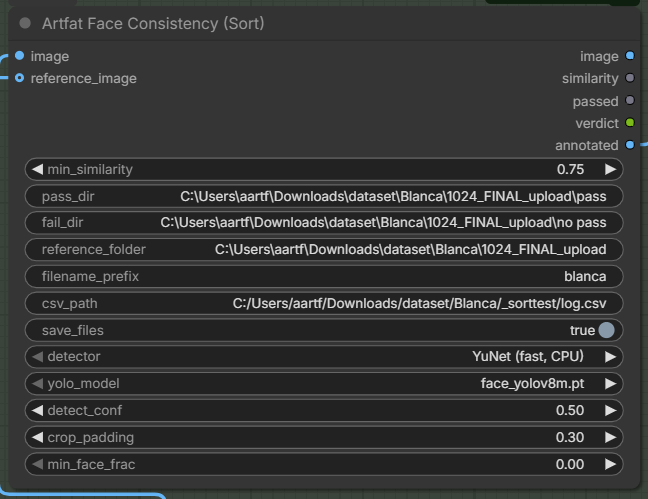
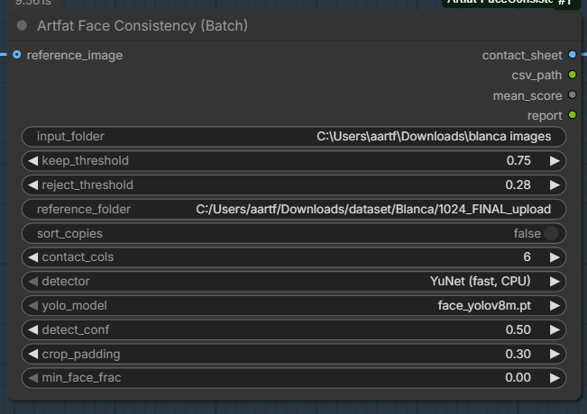

# ComfyUI — Artfat Face Consistency

Face-identity consistency scoring, built on OpenCV's **YuNet** (detector) +
**SFace** (recognizer). Pure `cv2` + `numpy` on **CPU** — it never touches VRAM,
so it runs happily alongside the sampler.

Two nodes, one shared scoring core (identical to the `face_consistency_sort.py`
script):



## Installation

Clone into your ComfyUI `custom_nodes` folder and restart:

```bash
cd ComfyUI/custom_nodes
git clone https://github.com/artfat-creator/ComfyUI-Artfat-FaceConsistency
```

Restart ComfyUI — the nodes appear under the **`artfat`** category.

> **If the nodes don't show up** — or a saved workflow loads them looking broken /
> with missing widgets — fully **restart ComfyUI** once more. If it persists,
> right-click the node → **Fix node (recreate)**, or just delete it and re-add it
> from the `artfat` menu. (This is normal after a node's inputs change.)

**Dependencies:** `opencv-python` + `numpy` (both ship with ComfyUI). The detector
models (`yunet.onnx`, `sface.onnx`) are **bundled** in `models/` — nothing extra to
download, and the default **YuNet** detector works out of the box.

**Optional YOLO detector** (more robust on full-body / small faces) needs:
1. `ultralytics` — already present in most ComfyUI installs; otherwise `pip install ultralytics`.
2. A face `.pt` model. Download e.g. **`face_yolov8m.pt`** from
   [Bingsu/adetailer on Hugging Face](https://huggingface.co/Bingsu/adetailer/tree/main)
   and place it in **`ComfyUI/models/ultralytics/bbox/`**. *(If you already use
   ComfyUI-Impact-Pack / ADetailer, you very likely have these models already.)*

## Artfat Face Consistency (Sort) — inline gate
Score each generated frame against a reference identity and sort it to disk.



It **discriminates**, it doesn't just pass everything — the same reference,
three frames, one rejected:



- **Inputs:** `image`, `min_similarity` (cosine pass threshold), `pass_dir`,
  `fail_dir`; optional `reference_image` (IMAGE batch 1..N), `reference_folder`,
  `filename_prefix`, `csv_path`, `save_files`.
- **Outputs:** `image` (passthrough), `similarity` (FLOAT), `passed` (BOOLEAN),
  `verdict` (STRING), `annotated` (IMAGE with a score badge).
- Passing frames go to `pass_dir`, failing/no-face to `fail_dir`, with the score
  baked into the filename (`blanca_00007_sim0.782_pass.png`) and appended to CSV.

## Artfat Face Consistency (Batch) — folder analysis
Point it at a folder of ready images + reference(s); get a labelled contact
sheet, a CSV, and (optionally) keep/reject copies.

- **Inputs:** `input_folder`, `keep_threshold`, `reject_threshold`; optional
  `reference_image`, `reference_folder`, `sort_copies`, `contact_cols`.
- **Outputs:** `contact_sheet` (IMAGE → Preview), `csv_path`, `mean_score`
  (FLOAT, near-zero detector glitches dropped), `report`.
- No reference given → auto-medoid of the input set.

## Reference handling
`reference_image` (an IMAGE batch of 1..N) and `reference_folder` are **merged
and averaged into one centroid**. More references = a steadier anchor — a
dataset centroid beats a single frame, which beats a self-medoid.

## Detector: YuNet vs YOLO
Both nodes expose a `detector` choice plus capture settings:

- **YuNet (fast, CPU)** — default, pure cv2, zero VRAM. Excellent on portraits /
  upper-body. Can score low on a *small* face in a busy full-body shot.
- **YOLO (robust, full-body)** — finds the face even when small/angled, crops it
  with padding, then re-aligns with YuNet so SFace gets a big clean face. Uses a
  `.pt` face model (auto-discovered from `models/ultralytics/bbox`,
  `models/upscale_models`, etc.). Requires `ultralytics` (ships with most ComfyUI
  installs; `pip install ultralytics` otherwise).

Capture settings (apply to YOLO): `detect_conf` (lower = catches harder/smaller
faces), `crop_padding` (context around the face before scoring), `min_face_frac`
(ignore faces smaller than this fraction of the frame — skips background people).

| Sort node | Batch node |
|---|---|
|  |  |

## Example workflows
Drag either file from `example_workflows/` onto the ComfyUI canvas, then repoint
the placeholder paths (`your_model.safetensors`, `your_persona_lora.safetensors`,
`C:/path/to/...`, `reference_face.png`) at your own model / LoRA / folders.

- **`face_consistency_generate.json`** — txt2img **with a persona LoRA**
  (split UNET + CLIP + VAE loaders, e.g. Krea2/Flux) → the **Sort** node gates
  each generation against a reference face (the intended live use: generate →
  auto-pass/fail).
- **`face_consistency_batch.json`** — minimal **Batch** curation: a reference
  image + a folder → a labelled contact sheet.

## Notes
- Near-zero cosine (`< 0.1`) usually means SFace failed to embed that crop
  (a detector glitch), **not** a real identity mismatch — the Batch mean drops
  these so one bad crop doesn't skew the score.
- Models (`yunet.onnx`, `sface.onnx`) ship in `models/`.
- Roadmap: a `Sample Until Consistent` node (owns the sampler, retries on a new
  seed until it passes) — deferred.

MIT.
